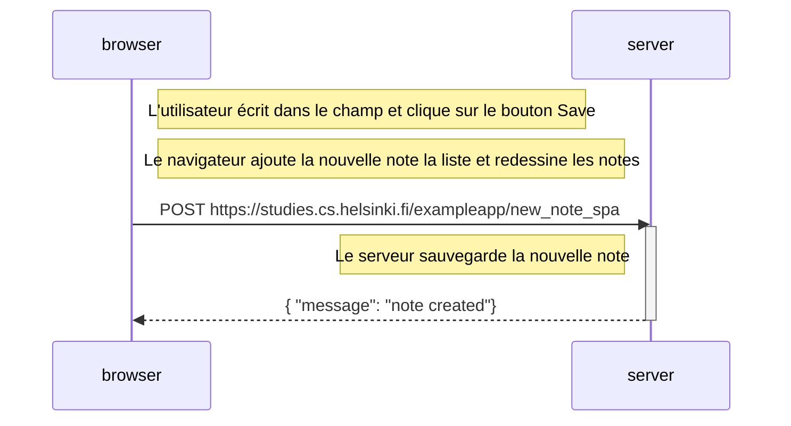

```mermaid
sequenceDiagram
    participant browser
    participant server

    Note right of browser: L'utilisateur écrit dans le champ et clique sur le bouton Save
    Note right of browser: Le navigateur ajoute la nouvelle note la liste et redessine les notes
    browser->>server: POST https://studies.cs.helsinki.fi/exampleapp/new_note_spa
    activate server
    Note left of server: Le serveur sauvegarde la nouvelle note
    server-->>browser: { "message": "note created"}
    deactivate server
```
